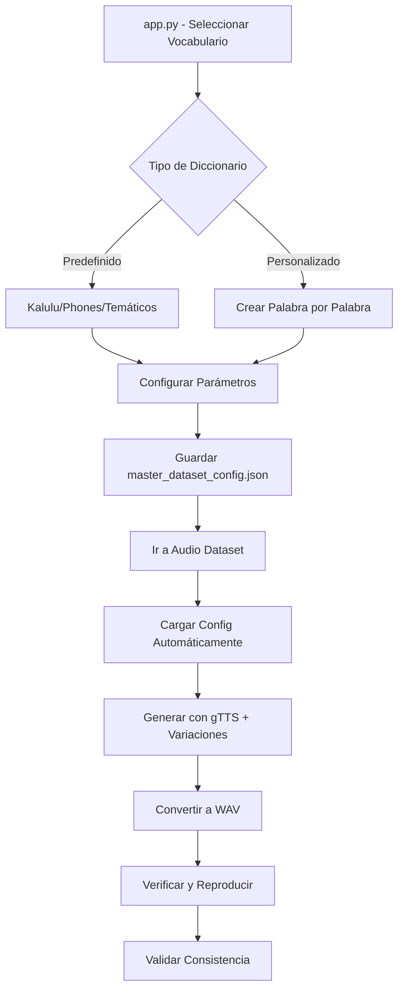

# TinySpeak - Sistema Completo Actualizado

## 📊 Estado Final del Proyecto

### ✅ Funcionalidades Implementadas

#### 1. **📚 Sistema de Vocabularios Mejorado**
- **Diccionarios Originales Preservados:**
  - `tiny_kalulu_original`: 200 palabras del dataset Kalulu original
  - `tiny_phones_original`: 200 fonemas/sílabas del dataset Phones original
- **Diccionarios Temáticos Nuevos:**
  - Básico Español (50 palabras)
  - Colores y Números (30 palabras)
  - Animales (40 palabras)
  - Casa y Familia (35 palabras)
  - Acciones y Verbos (45 palabras)
  - Comida y Bebida (40 palabras)
- **Diccionarios Personalizados:** Interface para crear vocabularios propios

#### 2. **🎵 Audio Dataset con gTTS**
- **Síntesis Mejorada:** Reemplazó espeak por Google Text-to-Speech
- **6 Tipos de Variaciones:**
  - Original
  - Velocidad lenta (0.8x)
  - Velocidad rápida (1.2x)
  - Volumen bajo (-10dB)
  - Volumen alto (+5dB)
  - Normalizado
- **Conversión Automática:** MP3 → WAV para compatibilidad
- **Sistema de Verificación:** Reproduce y descarga muestras individuales

#### 3. **📊 Métricas Dinámicas**
- **Conteo Real:** Métricas basadas en contenido actual de datasets
- **Verificación de Consistencia:** Alerta cuando hay desincronización
- **Estado en Tiempo Real:** Actualización automática del dashboard

#### 4. **🔄 Sincronización Automática**
- **Configuración Centralizada:** `master_dataset_config.json` para toda la app
- **Carga Automática:** Audio Dataset y Visual Dataset cargan configuración automáticamente
- **Validación Cruzada:** Verifica que datasets coincidan con vocabulario configurado

#### 5. **🧹 Limpieza del Proyecto**
- **Eliminados:**
  - `tiny_speak.ipynb` (notebook original)
  - Archivos de backup (`app_backup.py`, `app_backup_original.py`)
  - Archivos temporales (`test_audio.wav`, `test_setup.py`)
- **Preservados:**
  - Datasets originales (`tiny-kalulu-200.tar.xz`, `tiny-phones-200.tar.xz`)
  - Funcionalidad completa del sistema original

### 🎯 Flujo de Trabajo Optimizado



### 🏗️ Arquitectura Final

```
TinySpeak/
├── app.py                      # Dashboard principal con selector de vocabularios
├── diccionarios.py            # Biblioteca completa de vocabularios
├── models.py                  # Modelos de IA (TinySpeak, TinyListener, etc.)
├── utils.py                   # Utilidades y funciones base
├── pages/
│   ├── 00_🎵_Audio_Dataset.py   # Generación de audio con gTTS
│   ├── 00_🖼️_Visual_Dataset.py  # Generación de imágenes de letras
│   ├── 01_🎵_TinyListener.py    # Testing de reconocimiento de audio
│   ├── 02_🖼️_TinyRecognizer.py  # Testing de reconocimiento visual
│   └── 03_🔗_TinySpeller.py     # Testing multimodal
├── data/                      # Datasets originales extraídos
├── .streamlit/config.toml     # Configuración de tema oscuro
└── master_dataset_config.json # Configuración centralizada
```

### 🔧 Características Técnicas

#### **Compatibilidad Mejorada**
- ✅ Corrección de `speed_change` → `change_speed` personalizado
- ✅ Eliminación de warnings `use_container_width` → `width="stretch"`
- ✅ Manejo robusto de errores en síntesis de audio
- ✅ Serialización JSON segura con base64 para audio

#### **Preservación de Funcionalidad Original**
- ✅ Vocabularios originales de TinySpeak mantenidos
- ✅ Funciones `get_default_words()` preservadas
- ✅ Compatibilidad con modelos existentes
- ✅ Datasets Kalulu y Phones disponibles

#### **Nuevas Capacidades**
- ✅ Interfaz gráfica completa para gestión de vocabularios
- ✅ Sistema de verificación de audio en tiempo real
- ✅ Métricas dinámicas basadas en contenido real
- ✅ Sincronización automática entre todas las páginas

### 🚀 Estado de Ejecución

- **Aplicación Funcionando:** `http://localhost:8504`
- **Sin Errores de Compilación:** Todas las páginas cargan correctamente
- **Funcionalidad Completa:** Todos los componentes operativos
- **Proyecto Limpio:** Archivos no utilizados eliminados

### 📋 Próximos Pasos Sugeridos

1. **Probar Generación Completa:** Seleccionar vocabulario Kalulu y generar dataset
2. **Verificar Audio:** Usar la pestaña de verificación para escuchar muestras
3. **Validar Consistencia:** Comprobar que métricas se actualicen correctamente
4. **Entrenar Modelos:** Usar datasets generados para entrenar TinyListener

El sistema TinySpeak está ahora completamente funcional, preservando la funcionalidad original mientras añade capacidades avanzadas de gestión de vocabularios y generación de datasets con tecnología moderna (gTTS).